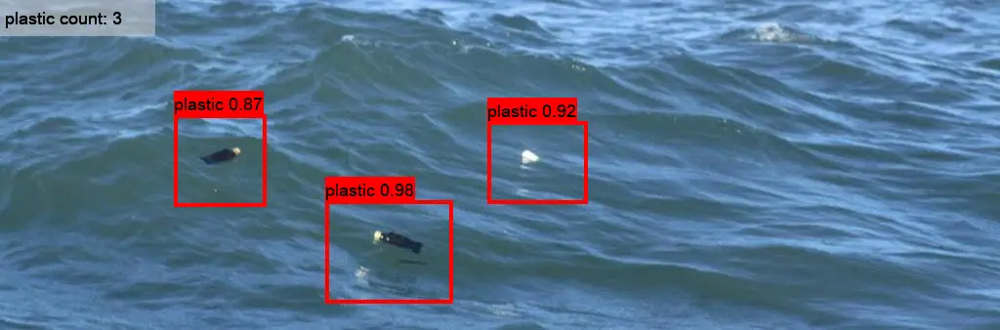

# FLOTVIS
  

A real-time object detector API for floating plastic litter, built with YOLOv4 and Keras/Tensorflow.  

# Contents
```
FLOTVIS .  
├── VOCdevkit               # Main training dataset  
│   └── VOC2007  
│       ├── Annotations  
│       ├── JPEGImage  
│       └── ImageSet  
│           └── Main  
├── model_data              # weights and anchors  
│   ├── yolov4_anchors.txt  
│   ├── yolov4_weights.h5   
│   └── ...  
├── nets                    # backbone and evaluation functions  
│   ├── CSPdarknet53.py  
│   ├── loss.py  
│   ├── ious.py  
│   └── yolo4.py  
├── test                    # dataset for testing  
│   ├── test1.jpg  
│   └── ...  
└── utils                   # utilities  
    ├── util.py  
    └── gputil.py  
```

## Dependencies:

```
tensorflow==1.15.2
Keras==2.1.5
scipy==1.2.1
numpy==1.17.0
matplotlib==3.1.2
opencv_python==4.1.2
tqdm==4.60.0
Pillow==8.2.0
h5py==2.10.0
```

# Preparing Dataset
* [LabelImg](https://github.com/tzutalin/labelImg) for creating ground truth bounding box 
  default output in `.xml`  
  class(es): plastic  
  YOLO4 data format: `class_number <x_center> <y_center> <width> <height>`  

# Detection
```
# predict single image
python3 predict.py --mode='image' --img='test/test.jpg'
# predict all images in folder
python3 predict.py --mode='batch' --imgdir='./test/'
# predict video
python3 predict.py --mode='video' --vid='test/test.mp4'
# predict using camera
python3 predict.py --mode='camera'
# get FPS
python3 predict.py --mode='fps'
```

## References
[mean Average Precision (mAP)](https://github.com/Cartucho/mAP)  
[Complete-IoU Loss and Cluster-NMS](https://github.com/Zzh-tju/CIoU)  
[ImgAug](https://github.com/aleju/imgaug)  
[LabelImg](https://github.com/tzutalin/labelImg)  
[Semantic Versioning](https://semver.org/spec/v2.0.0.html)  
[YOLO implementation on Keras/TF2](https://github.com/schissmantics/yolo-tf2)  
[YOLO implementation on Keras](https://github.com/yuto3o/yolox)  
[YOLOv4 implementation on Keras](https://github.com/taipingeric/yolo-v4-tf.keras)  
[YOLOv4 implementation on Keras](https://github.com/miemie2013/Keras-YOLOv4)  
[YOLOv4 implementation on Keras](https://github.com/bubbliiiing/yolov4-keras)  
[A neat implementation of YOLO v3 with TF 2.2 and Keras](https://github.com/schissmantics/yolo-tf2)  
[A popular Implementation of YOLO v3 based on multi-backend Keras](https://github.com/qqwweee/keras-yolo3/)  
[Another Implementation of YOLO v3 based on multi-backend Keras](https://github.com/experiencor/keras-yolo3)  